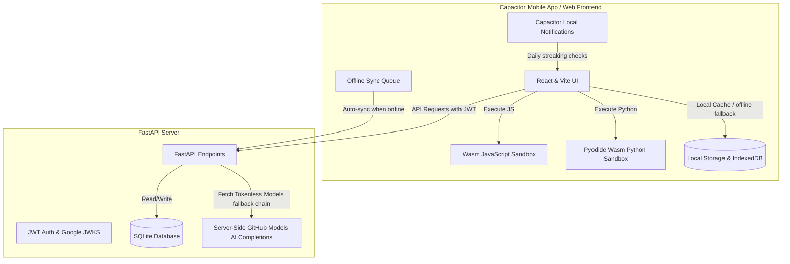

# Codempress — Architectural Design Specification

> Canonical target specification. This document defines a **gamified,
> offline-first programming education platform** that guides users from theory
> to practice across modern engineering domains.
>
> **Status:** Specification (reference). The currently-implemented app uses a
> Next.js + Prisma + PostgreSQL stack. See `docs/ARCHITECTURE_ANALYSIS.md` for
> the divergence/comparison and recommendation.

---

## 1. System Topology



---

## 2. Directory Layout

```
Codempress/
├── backend/
│   ├── main.py                # FastAPI endpoints, JWT auth, database CRUD, and mastery logic
│   └── skillforge.db          # Embedded production SQLite database (created on startup)
├── content/
│   ├── curriculum.py          # Hardcoded knowledge tree metadata categories
│   ├── seed_topics.py         # Content seeder to initialize the SQLite categories
│   └── content_generator.py   # Legacy seeder utilizing Pollinations completions
├── database/
│   └── schema.sql             # SQL script specifying table DDLs and indexing
├── frontend/
│   ├── android/               # Capacitor Android native platform project directory
│   ├── src/
│   │   ├── pages/
│   │   │   ├── Landing.jsx    # Authentication gateway
│   │   │   ├── Library.jsx    # Arcane Library topic tree and mastery display
│   │   │   ├── Subject.jsx    # Subject topic modules progression dashboard
│   │   │   ├── TopicReader.jsx# Markdown reader, theory complete logger
│   │   │   ├── Quiz.jsx       # Shuffled MCQs, orange selected states, 70% threshold
│   │   │   ├── Forge.jsx      # JS and Pyodide Wasm Python code runtimes
│   │   │   └── Profile.jsx    # Streak, XP logs, and "IAmInevitable" treats override
│   │   ├── api.js             # HTTP request wrappers, offline queues, app version checks
│   │   ├── App.jsx            # Routing, system shell, update notifications, back button handlers
│   │   ├── main.jsx           # Vite application entrypoint
│   │   └── styles.css         # Modern light theme CSS styles (contrast-ratio validated)
│   ├── package.json           # Frontend Node dependency manifest
│   ├── vite.config.js         # Build and proxy definitions
│   └── capacitor.config.json  # Native plugin configuration
└── CodeEmpress-debug.apk      # Root Android package compiled for manual installations
```

---

## 3. Database Schema Specification

`SQLite` relational database. Primary keys standard `_id` auto-increment.

### 3.1 Tables

#### `users`
```sql
CREATE TABLE users (
    _id INTEGER PRIMARY KEY AUTOINCREMENT,
    google_sub TEXT UNIQUE,
    email TEXT,
    name TEXT,
    avatar_url TEXT,
    total_xp INTEGER DEFAULT 0,
    created_at TIMESTAMP DEFAULT CURRENT_TIMESTAMP
);
```

#### `topics`
```sql
CREATE TABLE topics (
    _id INTEGER PRIMARY KEY AUTOINCREMENT,
    category TEXT NOT NULL,
    title TEXT NOT NULL,
    description TEXT,
    level INTEGER DEFAULT 0,
    level_name TEXT,
    difficulty_rating REAL DEFAULT 1.0,
    is_locked INTEGER DEFAULT 0,
    xp_reward INTEGER DEFAULT 50,
    sequence INTEGER NOT NULL,
    sort_order INTEGER DEFAULT 0,
    theory_intro TEXT,
    theory_examples TEXT, -- JSON Array of examples
    theory_best_practices TEXT -- JSON Array of best practices
);
```

#### `questions`
```sql
CREATE TABLE questions (
    _id INTEGER PRIMARY KEY AUTOINCREMENT,
    topic_id INTEGER NOT NULL,
    question_text TEXT NOT NULL,
    code_snippet TEXT,
    options TEXT NOT NULL, -- JSON Array of 4 strings
    correct_answer INTEGER NOT NULL, -- 0-3 index
    explanation TEXT,
    difficulty TEXT,
    skill_points INTEGER DEFAULT 10,
    time_seconds INTEGER DEFAULT 30,
    is_active INTEGER DEFAULT 1,
    FOREIGN KEY(topic_id) REFERENCES topics(_id)
);
```

#### `user_progress`
```sql
CREATE TABLE user_progress (
    _id INTEGER PRIMARY KEY AUTOINCREMENT,
    user_id TEXT NOT NULL,
    topic_id INTEGER NOT NULL,
    theory_read INTEGER DEFAULT 0,
    theory_completed_at TIMESTAMP,
    quiz_attempts INTEGER DEFAULT 0,
    quiz_correct INTEGER DEFAULT 0,
    quiz_completed INTEGER DEFAULT 0,
    mastery_percent REAL DEFAULT 0.0,
    last_accessed TIMESTAMP DEFAULT CURRENT_TIMESTAMP,
    quiz_order TEXT DEFAULT '', -- JSON Array of randomized question IDs
    FOREIGN KEY(user_id) REFERENCES users(google_sub),
    FOREIGN KEY(topic_id) REFERENCES topics(_id),
    UNIQUE(user_id, topic_id)
);
```

#### `user_streak`
```sql
CREATE TABLE user_streak (
    _id INTEGER PRIMARY KEY AUTOINCREMENT,
    user_id TEXT UNIQUE NOT NULL,
    current_streak INTEGER DEFAULT 0,
    longest_streak INTEGER DEFAULT 0,
    last_activity_date TEXT,
    FOREIGN KEY(user_id) REFERENCES users(google_sub)
);
```

---

## 4. Key Systems & Runtimes

### 4.1 Server-Side AI Generation + Fallback
`/api/topics/{id}/generate` generates theory and questions on demand.
1. Reads `GITHUB_TOKEN` from shell env (never shipped to web assets).
2. Fallback chain over `GITHUB_MODELS`; on 429/limit, cools down the model and
   transparently moves to the next endpoint.

### 4.2 Interactive Code Forge Sandbox
1. **JS Sandbox** — compiled in an isolated iframe using `eval` wrappers.
2. **Python Pyodide Sandbox** — fetches official WebAssembly Pyodide from CDN,
   boots in a worker thread, runs locally in-browser.
3. **Mobile responsive** — `@media (max-width: 768px)` stacks input above output.

### 4.3 Offline Queue Synchronization
1. `markTheoryRead`, `submitQuizRun`, `answerQuiz` queue to `localStorage`.
2. Local cache indexes simulate unlocks; offline `getTopic` reads update cache.
3. On `navigator.onLine`, process the queue sequentially.

### 4.4 Soft Graded Selections
- Select an option → immediate `.option.selected` (soft orange border/overlay).
- Turn green (correct) / red (incorrect) only when the graded response resolves.

---

## 5. Security & Build Lifecycle

1. **Auth:** Google Identity Services; clients exchange ID tokens via
   `/api/auth/google`; server validates against Google JWKS, issues local HS256
   JWT (7-day) stored in `localStorage` (`sf_token`).
2. **Build:** `npm run build` (Vite) → `npx cap sync android` → Gradle compile →
   `CodeEmpress-debug.apk`.
